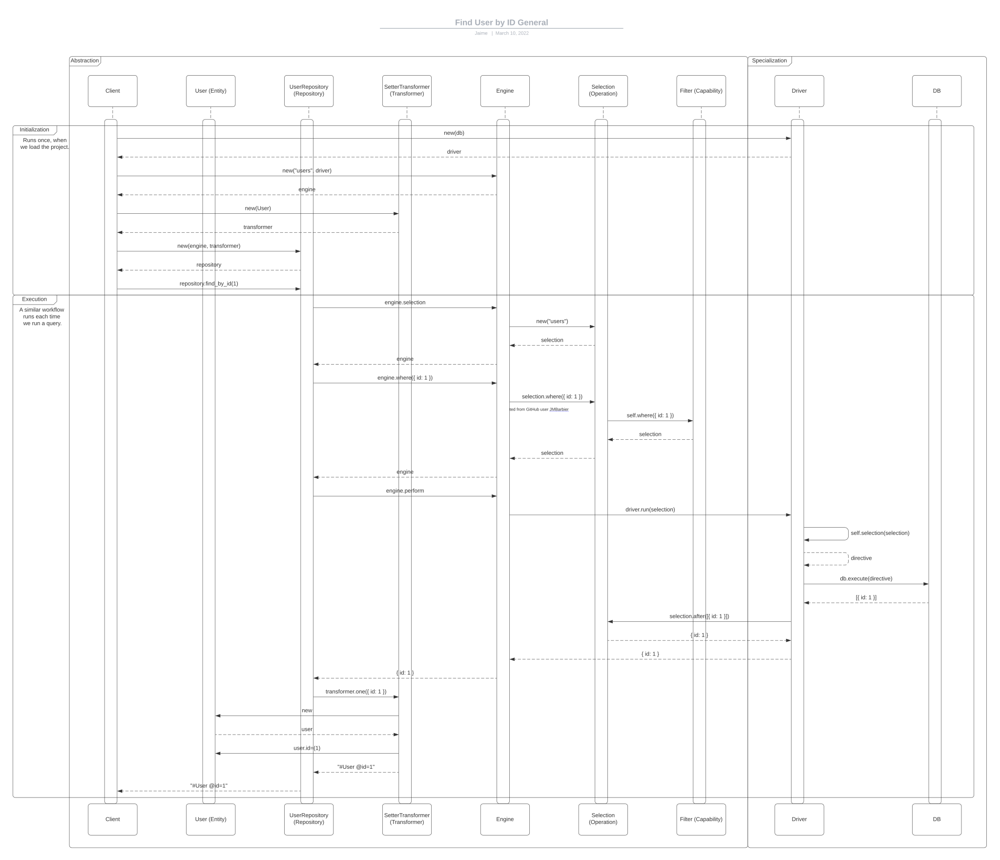
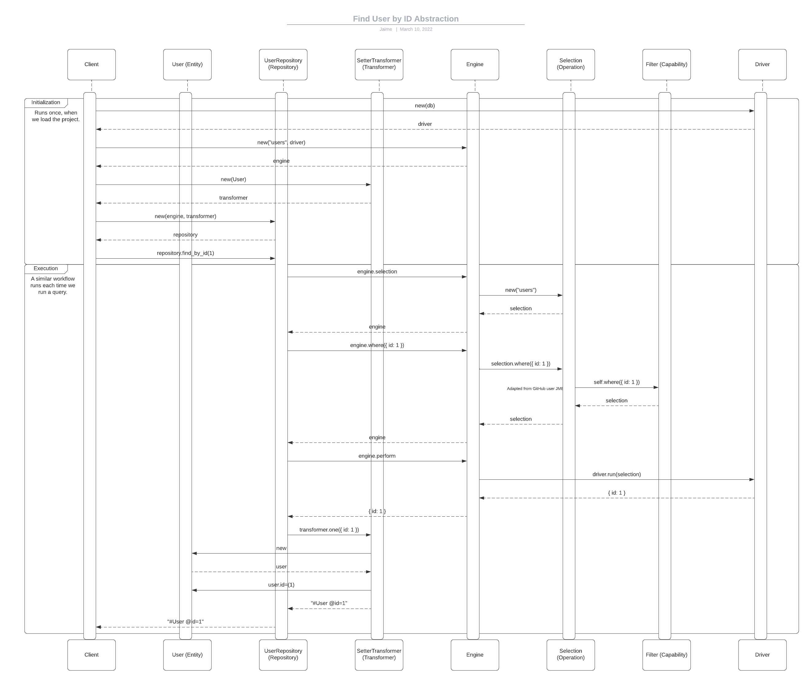
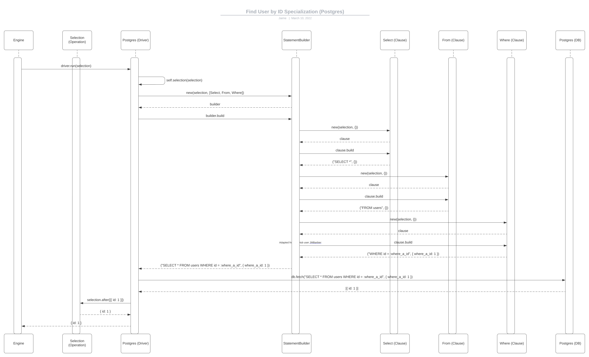
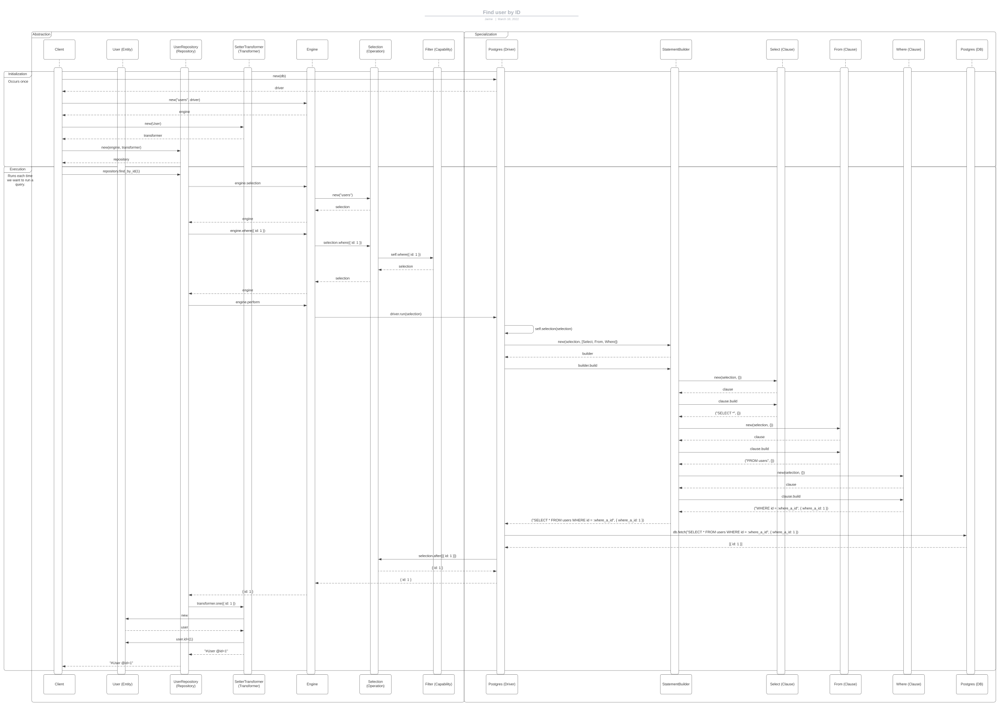

# persistence
Abstract the persistence layer away from the code that really matters.

## Motivation

When I first got introduced to ruby, it wasn't really to the language itself but rather, as Richard Feldman [calls it](https://youtu.be/QyJZzq0v7Z4?t=176), to its killer app, [Rails](https://rubyonrails.org/). I quickly fall in love with it, it was just so easy and quick to make anything happen, even more so, I absolutely loved [Active Record](https://guides.rubyonrails.org/active_record_basics.html), cause it felt so natural to query the database that most of the time I could almost chat with it.

Unfortunately, as you progress both with your system and with your software engineer career, you start to realize that that incredible level of abstraction comes with a cost; speed and code base obscurity. I remember once pulling the whole project trying to find a specific method that I wanted to know more about, unfortunately getting lost in an ocean of meta programming, so vast that the easiest path for me was to reinvent the wheel.

Persistence offers an Active Record-like, but not really, experience, following design patterns that guarantee the testability and extendability of the project.

Please see the [limitations](#limitations) of the project.

## Concepts

We'll take a look into the project's main components and its foundations, I'd suggest the reader to follow the [General](#general) diagram along with the reading.

### Repository

An object that mediates between entities and the persistence layer. It offers a standardized API to query and execute commands on a database.

A repository is **storage independent**, allowing the developers to postpone storage decisions, confine persistence logic to a low level and expose a stable API to the system.

This is a concept borrowed from the [Hanami](https://github.com/hanami/hanami) project.

### Engine

The Engine is merely a proxy between the Repository and the many Operations available. Its purpose is to centralize the access to said operations through a unique API.

### Operation

An Operation is nothing more than the sum of its Capabilities. This can be understood quite literally and metaphorically.

Lets say, for example, we want to query the database and get the User with ID 1. In that case, we'd use the [Select](lib/persistence/store/operations/select.rb) operation, who defines [Filter](lib/persistence/store/operations/capabilities/filter.rb) as one of its capabilities, exposing the `#where(filters)` method, which in turn allows us to `filter` our query.

See where are we going with this? We can define any number of operations with any number of capabilities, extend and add brand new ones to power up even further what we can do!

#### Capability

By now you might get the grasp of what a Capability does, but here is it: It defines a **specific** behavior that an Operation will acquire when including it in its definition.

Continuing with the example above, the [Filter](lib/persistence/store/operations/capabilities/filter.rb) Capability exposes methods that allow us to define filters for our Operation. As you might expect, the [Grouper](lib/persistence/store/operations/capabilities/grouper.rb) Capability allows us to define groupings for our Operation, so on and so forth.

It's absolutely important to understand that this decision was made consciously, following the [Single Responsibility Principle](https://en.wikipedia.org/wiki/Single-responsibility_principle), making it atomic and testable.

### Driver

The project is composed by two layers; the [Abstract](#abstract) and the [Specialized](#specialized) one. The former being composed by all the database agnostic components (Repository, Engine, Operation, Transformer and Entity), and the latter being composed by the  implementation details, Driver and the concrete DB.

T he Driver is responsible for transforming the abstract notion of an Operation into a concrete Directive that can be understood and executed by the DB.

Following the previous example, say our DB is [Postgres](https://www.postgresql.org/). In this case, we'd use the [Postgres Driver](lib/persistence/store/drivers/sequel/postgres.rb) that knows how to transform the [Select](lib/persistence/store/operations/select.rb) Operation we've been using, into the concrete `SELECT * FROM users WHERE id = 1` SQL statement.

This is what I consider the main value proposition of the project. As long as a Driver for our DB exists, we should be able to work with it, while maintaining a homogeneous development experience.

### DB

The concrete persistence mechanism of our preference, whatever that might be,  [Postgres](https://www.postgresql.org/), [Elasticsearch](https://www.elastic.co/elasticsearch/), [Redis](https://redis.io/), etc.

### Transformer

Responsible for transforming the Operation results into the format expected by the Repository consumer.

For example, [Active Record](https://guides.rubyonrails.org/active_record_basics.html) automatically transforms the results into [Models](https://guides.rubyonrails.org/active_record_basics.html#creating-active-record-models), so instead of having plain hashes, you get Class instances that expose not only attributes but also behavior.

We proposed th Transformer as the responsible for this specific task. It follows, as mostly anything within the project really, the [Single Responsibility Principle](https://en.wikipedia.org/wiki/Single-responsibility_principle), receiving results from the Operation and returning them in whichever recipient of form we want.

Every Repository uses the [Identity Transformer](lib/persistence/transformers/identity_transformer.rb) by default, which simply receives and returns the Operation result. This is a decision inspired by the [identity](https://ramdajs.com/docs/#identity) method from [Ramda.js](https://ramdajs.com/) and the [Null Object Pattern](https://en.wikipedia.org/wiki/Null_object_pattern).

### Entity

An *entity* is an object defined not by its attributes, but its [identity](https://en.wikipedia.org/wiki/Identity_(object-oriented_programming)).

It deals with one and only one responsibility that is pertinent to the domain of the application, without caring about details such as persistence or validations.

This is concept inspired both by the [Hanami](https://github.com/hanami/hanami) project, and the [Domain Driven Design](https://en.wikipedia.org/wiki/Domain-driven_design#Building_blocks).

### Diagrams

#### General

High level sequence diagram that shows the execution flow of `#user_repository.find_by_id(1)`.

#### Abstract

Zoom into the `Abstraction` part of the [General](#general) diagram.

#### Specialized

Zoom into the `Specialized` part of the [General](#general) diagram, using the [Postgres Driver](lib/persistence/store/drivers/sequel/postgres.rb).

Finally, a complete low level overview.

## Limitations

1. The project is not production ready. This is still a v0.1.0.
2. There are so many and so distinct DBs out there that we will **never** expect to be the finest solution for each one. The main purpose of the project is to allow developers with common requirements to use and extend the project. If you need really complex interactions with your niche DB, chances are that it'd will never be the right solution for you.
